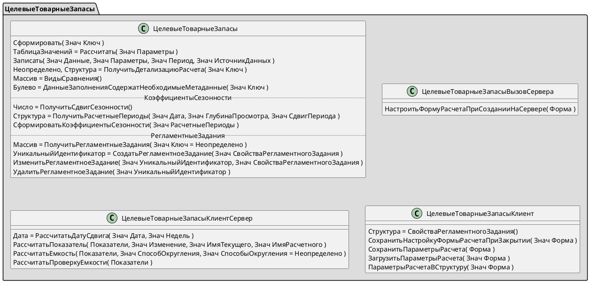
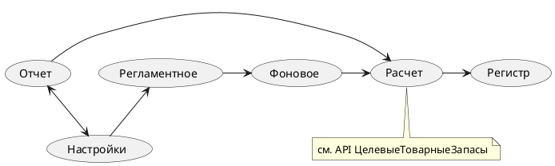

# Автоматическое обновление значений целевого товарного запаса

[SRS-148. Автоматическое обновление значений целевого товарного запаса.](https://petrovichstd.com/confluence/pages/viewpage.action?pageId=126127068)

[Сокращения и термины](https://petrovichstd.com/confluence/pages/viewpage.action?pageId=126127068#SRS148.%D0%90%D0%B2%D1%82%D0%BE%D0%BC%D0%B0%D1%82%D0%B8%D1%87%D0%B5%D1%81%D0%BA%D0%BE%D0%B5%D0%BE%D0%B1%D0%BD%D0%BE%D0%B2%D0%BB%D0%B5%D0%BD%D0%B8%D0%B5%D0%B7%D0%BD%D0%B0%D1%87%D0%B5%D0%BD%D0%B8%D0%B9%D1%86%D0%B5%D0%BB%D0%B5%D0%B2%D0%BE%D0%B3%D0%BE%D1%82%D0%BE%D0%B2%D0%B0%D1%80%D0%BD%D0%BE%D0%B3%D0%BE%D0%B7%D0%B0%D0%BF%D0%B0%D1%81%D0%B0-%D0%A1%D0%BE%D0%BA%D1%80%D0%B0%D1%89%D0%B5%D0%BD%D0%B8%D1%8F,%D0%B0%D0%B1%D0%B1%D1%80%D0%B5%D0%B2%D0%B8%D0%B0%D1%82%D1%83%D1%80%D1%8B%D0%B8%D1%84%D0%BE%D1%80%D0%BC%D0%B0%D1%82%D0%B8%D1%80%D0%BE%D0%B2%D0%B0%D0%BD%D0%B8%D0%B5)

## Метаданные

### Подсистема

УправлениеЗапасами/ЦелевыеТоварныеЗапасы

## Public API

### Общие модули

[ЦелевыеТоварныеЗапасы]: ../../public/%D0%9E%D0%B1%D1%89%D0%B8%D0%B5%20%D0%BC%D0%BE%D0%B4%D1%83%D0%BB%D0%B8/%D0%A6%D0%B5%D0%BB%D0%B5%D0%B2%D1%8B%D0%B5%D0%A2%D0%BE%D0%B2%D0%B0%D1%80%D0%BD%D1%8B%D0%B5%D0%97%D0%B0%D0%BF%D0%B0%D1%81%D1%8B.md "Общий модуль ЦелевыеТоварныеЗапасы"

[ЦелевыеТоварныеЗапасыКлиент]: ../../public/%D0%9E%D0%B1%D1%89%D0%B8%D0%B5%20%D0%BC%D0%BE%D0%B4%D1%83%D0%BB%D0%B8/%D0%A6%D0%B5%D0%BB%D0%B5%D0%B2%D1%8B%D0%B5%D0%A2%D0%BE%D0%B2%D0%B0%D1%80%D0%BD%D1%8B%D0%B5%D0%97%D0%B0%D0%BF%D0%B0%D1%81%D1%8B%D0%9A%D0%BB%D0%B8%D0%B5%D0%BD%D1%82.md "Общий модуль ЦелевыеТоварныеЗапасыКлиент"

* [ЦелевыеТоварныеЗапасы]
* [ЦелевыеТоварныеЗапасыВызовСервера](../../public/%D0%9E%D0%B1%D1%89%D0%B8%D0%B5%20%D0%BC%D0%BE%D0%B4%D1%83%D0%BB%D0%B8/%D0%A6%D0%B5%D0%BB%D0%B5%D0%B2%D1%8B%D0%B5%D0%A2%D0%BE%D0%B2%D0%B0%D1%80%D0%BD%D1%8B%D0%B5%D0%97%D0%B0%D0%BF%D0%B0%D1%81%D1%8B%D0%92%D1%8B%D0%B7%D0%BE%D0%B2%D0%A1%D0%B5%D1%80%D0%B2%D0%B5%D1%80%D0%B0.md)
* [ЦелевыеТоварныеЗапасыКлиентСервер](../../public/%D0%9E%D0%B1%D1%89%D0%B8%D0%B5%20%D0%BC%D0%BE%D0%B4%D1%83%D0%BB%D0%B8/%D0%A6%D0%B5%D0%BB%D0%B5%D0%B2%D1%8B%D0%B5%D0%A2%D0%BE%D0%B2%D0%B0%D1%80%D0%BD%D1%8B%D0%B5%D0%97%D0%B0%D0%BF%D0%B0%D1%81%D1%8B%D0%9A%D0%BB%D0%B8%D0%B5%D0%BD%D1%82%D0%A1%D0%B5%D1%80%D0%B2%D0%B5%D1%80.md)
* [ЦелевыеТоварныеЗапасыКлиент]



## Расчет целевого товарного запаса

Два варианта автоматического расчета и формирования целевого товарного запаса: [интерактивно](#отчет-целевые-товарные-запасы) и [регламентным заданием](#регламентные-задания).



В первую очередь выполняется расчет показателей, после анализа которых производится их запись на регистр сведений ["Целевые остатки подразделений (ПТР)"](https://git.a.kluatr.ru/dev1c/ut_10_3/-/blob/master/src/InformationRegisters/%D0%9F%D0%A2%D0%A0_%D0%A6%D0%B5%D0%BB%D0%B5%D0%B2%D1%8B%D0%B5%D0%9E%D1%81%D1%82%D0%B0%D1%82%D0%BA%D0%B8%D0%9F%D0%BE%D0%B4%D1%80%D0%B0%D0%B7%D0%B4%D0%B5%D0%BB%D0%B5%D0%BD%D0%B8%D0%B9.xml). Весь процесс формирования целевых товарных запасов осуществляется по единому алгоритму и не зависит от варианта расчета. Реализация выполнена в [публичном интерфейсе](#public-api).

Кроме результата на регистре сведений в реквизитах хранится вспомогательная информация: источник расчета, параметры и данные расчета. Параметры и данные расчета записываются в виде универсальной коллекции и предназначены для анализа результата расчета в интерактивном режиме. Их просмотр осуществляется через отчет "Целевые остатки подразделений", который открывается по команде на форме списка регистра.

При формировании целевых товарных запасов регламентным заданием выполняется дополнительный [анализ](https://petrovichstd.com/confluence/pages/viewpage.action?pageId=127798513) на ошибки расчета, фиксируемые на отдельном регистре сведений ["Ошибки расчета целевых товарных запасов"](https://git.a.kluatr.ru/dev1c/ut_10_3/-/blob/master/src/InformationRegisters/%D0%9E%D1%88%D0%B8%D0%B1%D0%BA%D0%B8%D0%A0%D0%B0%D1%81%D1%87%D0%B5%D1%82%D0%B0%D0%A6%D0%B5%D0%BB%D0%B5%D0%B2%D1%8B%D1%85%D0%A2%D0%BE%D0%B2%D0%B0%D1%80%D0%BD%D1%8B%D1%85%D0%97%D0%B0%D0%BF%D0%B0%D1%81%D0%BE%D0%B2.xml). На реквизитах этого регистра дополнительно сохраняется информация и о параметрах и данных расчетах. Способ их просмотра аналогичен просмотру данных для регистра с целевыми остатками подразделений.

### Отчет "Целевые товарные запасы"

Интерактивная работа пользователя осуществляется за счет имплементации [API](#public-api) на форме отчета. Форма должна содержать реквизиты, совпадающие по наименованию и типу с параметрами расчета (см. [ЦелевыеТоварныеЗапасыКлиент.ПараметрыРасчетаВСтруктуру](../../public/%D0%9E%D0%B1%D1%89%D0%B8%D0%B5%20%D0%BC%D0%BE%D0%B4%D1%83%D0%BB%D0%B8/%D0%A6%D0%B5%D0%BB%D0%B5%D0%B2%D1%8B%D0%B5%D0%A2%D0%BE%D0%B2%D0%B0%D1%80%D0%BD%D1%8B%D0%B5%D0%97%D0%B0%D0%BF%D0%B0%D1%81%D1%8B%D0%9A%D0%BB%D0%B8%D0%B5%D0%BD%D1%82.md "ЦелевыеТоварныеЗапасыКлиент.ПараметрыРасчетаВСтруктуру")). При создании формы на сервере производится [ее настройка](../../public/%D0%9E%D0%B1%D1%89%D0%B8%D0%B5%20%D0%BC%D0%BE%D0%B4%D1%83%D0%BB%D0%B8/%D0%A6%D0%B5%D0%BB%D0%B5%D0%B2%D1%8B%D0%B5%D0%A2%D0%BE%D0%B2%D0%B0%D1%80%D0%BD%D1%8B%D0%B5%D0%97%D0%B0%D0%BF%D0%B0%D1%81%D1%8B%D0%9A%D0%BB%D0%B8%D0%B5%D0%BD%D1%82.md "ЦелевыеТоварныеЗапасыВызовСервера.НастроитьФормуРасчетаПриСозданииНаСервере") и инициализация реквизитов значениями по умолчанию.

Программный интерфейс общего модуля [ЦелевыеТоварныеЗапасыКлиент] содержит реализацию работы с пользовательскими настройками формы, предназначенными как для передачи параметров расчета как между пользователями в интерактивном режиме, так и для автоматического формирования целевых товарных запасов регламентными заданиями. Используются типовые [универсальные механизмы](https://git.a.kluatr.ru/dev1c/ut_10_3/-/tree/master/src/CommonModules/%D0%A3%D0%BD%D0%B8%D0%B2%D0%B5%D1%80%D1%81%D0%B0%D0%BB%D1%8C%D0%BD%D1%8B%D0%B5%D0%9C%D0%B5%D1%85%D0%B0%D0%BD%D0%B8%D0%B7%D0%BC%D1%8B/Ext/Module.bsl "Общий модуль УниверсальныеМеханизмы") хранения пользовательских настроек.

Вывод результата расчета осуществляется в таблицу значений по требованию заказчика для возможности прямого редактирования записей. При разработке визуализации результата предполагался дальнейший отказ от таблицы значений в пользу динамического списка.

### Регламентные задания

Управление регламентными заданиями [реализовано][ЦелевыеТоварныеЗапасы] на форме [РегламентныеЗадания](https://git.a.kluatr.ru/dev1c/ut_10_3/-/blob/master/src/Reports/%D0%A6%D0%B5%D0%BB%D0%B5%D0%B2%D1%8B%D0%B5%D0%A2%D0%BE%D0%B2%D0%B0%D1%80%D0%BD%D1%8B%D0%B5%D0%97%D0%B0%D0%BF%D0%B0%D1%81%D1%8B/Forms/%D0%A0%D0%B5%D0%B3%D0%BB%D0%B0%D0%BC%D0%B5%D0%BD%D1%82%D0%BD%D1%8B%D0%B5%D0%97%D0%B0%D0%B4%D0%B0%D0%BD%D0%B8%D1%8F/Ext/Form.xml) отчета "Целевые товарные запасы". Для пользователей с полными правами в списке формы выводится дополнительная служебная информация: UUID регламентного задания.

Не предполагается удаление ранее запущенных фоновых задач при отключении флага *"Использовать"* или при редактировании регламентного задания.

В методах для фоновых реализованы проверки, выбрасывающие исключения для журнала регистрации с дополнительной детализацией ошибки.

> Ключом создаваемого фонового задания является представление настройки. Предполагается, что наименование уникально для всех пользователей.

## Расчет коэффициентов сезонности

[UC.148.FR7. Система должна автоматически рассчитывать и хранить коэффициент сезонности по каждой группе номенклатуры 3-го уровня за каждую неделю.](https://petrovichstd.com/confluence/pages/viewpage.action?pageId=130529333)

Управление расчетом коэффициентов сезонности осуществляется в пользовательском режиме через справочник *"Регламентные задания"* (см. *справочник "Внешние отчеты, обработки" -> "Консоль расписания заданий"*).

Пример шага действий (запуск только в воскресенье):

```bsl
ЗапускРазрешен = Ложь;
ТекДень = ДеньНедели(ТекущаяДата());

Если ТекДень = 7 Тогда
    ЗапускРазрешен = Истина;
КонецЕсли;

Если ЗапускРазрешен Тогда
    ЦелевыеТоварныеЗапасы.СформироватьКоэффициентыСезонности(ЦелевыеТоварныеЗапасы.ПолучитьРасчетныеПериоды(ТекущаяДата(), Константы.ГлубинаАнализаПродажКоэффициентСезонности.Получить(), ЦелевыеТоварныеЗапасы.ПолучитьСдвигСезонности()));
КонецЕсли;
```
